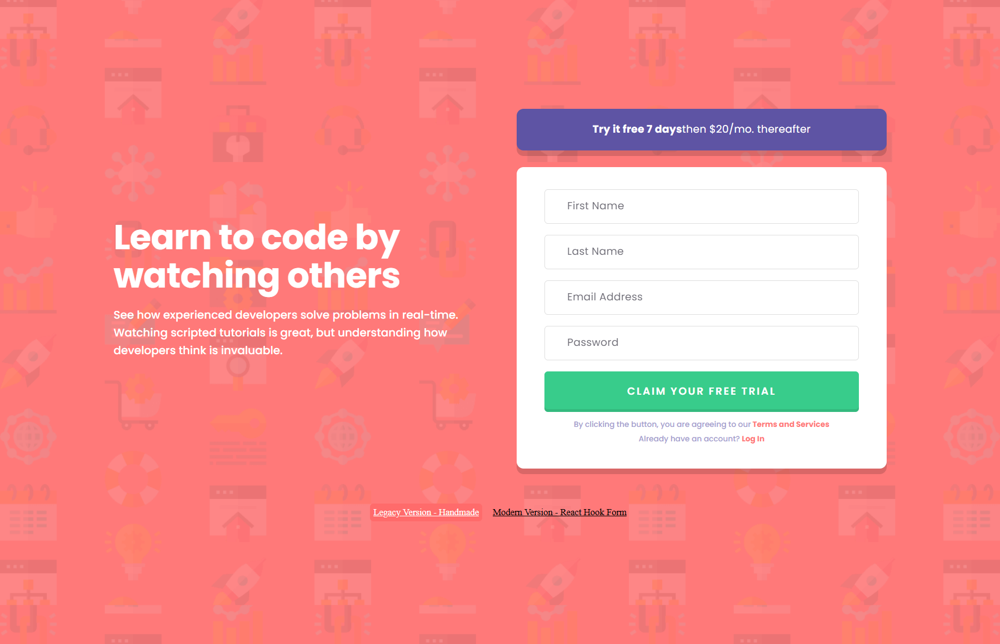

# Form Implementation Comparison

A React project demonstrating two different approaches to form implementation: handmade vs library-based.


### Legacy Version (Handmade)
- ✅ Custom hooks: useField, useAuth
- ✅ Manual validation logic
- ✅ Mock server with user "database"
- ✅ Dynamic registration/login flow
- ✅ Full state management

### Modern Version (React Hook Form + Zod)  
- ✅ Declarative validation with Zod schemas
- ✅ Optimized re-renders with isolated updates
- ✅ Built-in form states (loading, errors, etc.)
- ✅ TypeScript-ready validation
- ✅ Minimal boilerplate code

## Demo

https://playerfront.github.io/Intro-component-/

## 📱 Screenshots

### Desktop Version


### Mobile Version  
.png)

## Quick Start

# Install dependencies
npm install

# Start development server
npm run dev

## Testing

### Test Coverage & Results

**Overall Statistics:**
- **Test Suites:** 6 passed, 6 total ✅
- **Tests:** 58 passed, 58 total ✅
- **Total Coverage:** 96.9% 🎯
- **Execution Time:** 13.485 seconds

### Coverage Breakdown by Module

| Module | Statements | Branches | Functions | Lines |
|--------|------------|----------|-----------|-------|
| **All Files** | 96.9% | 87.5% | 96.87% | 96.9% |
| `Form.jsx` | 98.57% | 75.75% | 88.88% | 98.57% |
| `useField.js` | 97.95% | 75% | 100% | 97.95% |
| `useAuth.js` | 100% | 86.66% | 100% | 100% |
| `validation.js` | 95.77% | 97.36% | 100% | 95.77% |
| UI Components | 84.92% | 77.78% | 100% | 84.92% |

### Key Testing Areas

#### Form Component (98.57% coverage)
- Registration flow with all fields
- Login mode with email/password only
- Mode switching (register ↔ login)
- Form validation and error display
- Password visibility toggle
- Network error handling
- Form submission states

#### Custom Hooks (98.59% coverage)
- `useField` - form field state management
- `useAuth` - authentication logic
- Async operations and error states

#### Integration Tests
- Complete user registration → automatic login switch
- Validation error → correction → success flow
- Network failure → retry → success scenario
- Multiple rapid clicks protection

### Uncovered Lines (Areas for Improvement)
- `Form.jsx` lines 72-73, 101 - edge cases in form switching
- `useField.js` line 23 - specific validation scenario
- `validation.js` lines 32-34 - email format edge cases
- `PrimaryButton.jsx` - styling-related branches

### Test Commands

```bash
# Run all tests
npm test

# Run tests with coverage report
npm test -- --coverage

# Watch mode during development
npm test -- --watch

# Generate HTML coverage report
npm test -- --coverage --coverageReporters=html